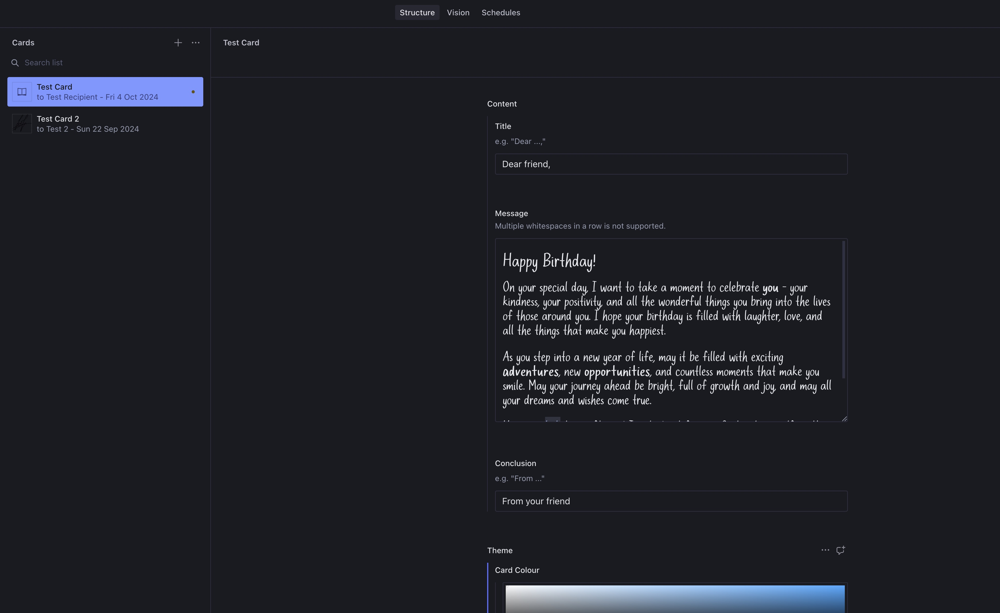
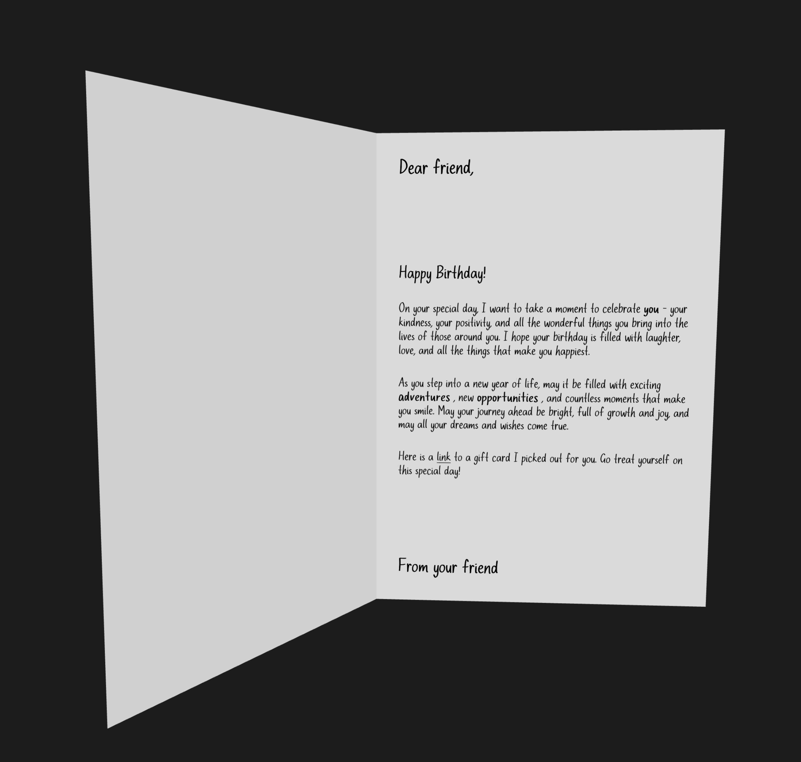

# Sentiments

> A work-in-progress web application to create and share personalized 3D greeting cards.

**Card creation and content management with Sanity**


**3D card viewer**


### Upcoming features
- Card opening animation with confetti
- Card cover image
- Mobile support

---

# Using a custom font for UIKit:
> For more details see https://pmndrs.github.io/uikit/docs/tutorials/custom-fonts.

## Prerequisites

- `assets/fonts/charset.txt` file containing all characters to include in the font.

- [FontForge](https://github.com/fontforge/fontforge)

```bash
$ brew install fontforge
```

- [msdf-bmfont-xml](https://github.com/soimy/msdf-bmfont-xml)

```bash
$ npm install msdf-bmfont-xml -g
```

## Steps

**Custom font**
1) Create a custom font (e.g. using FontSelf on iPad).
2) Export the font and convert it to `.ttf` if it isn't already.

**Existing font**
1) Download the `.ttf` font file.

### Building the font
1) Place the font file in the `assets/fonts/` directory.
2) Generate msdf font using the following command:

```bash
$ npm run fontgen -- MyFontName
```

### Note:
- Ensure there is only one output `.png` file per font. If not, increase the output image size until all characters fit in the texture by editing `scripts/generate-mdsf-font.mjs`.
- Generating the font with a small font size may result in inaccurate/undetailed characters (i.e. appearing too thick).